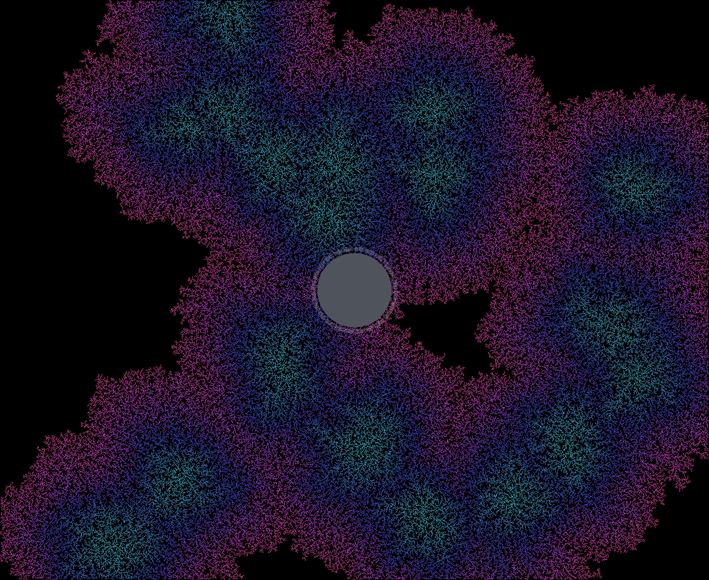
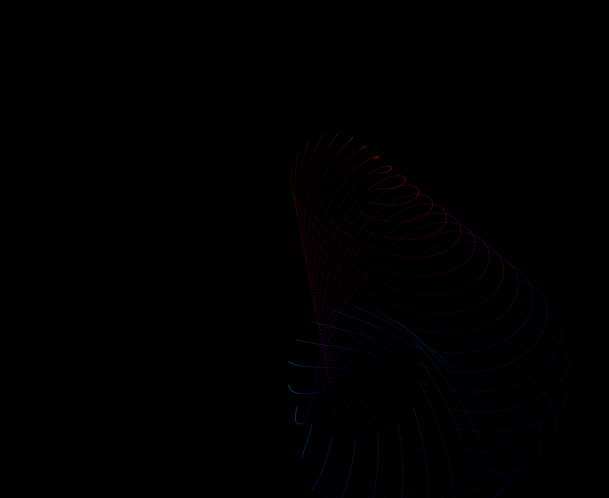
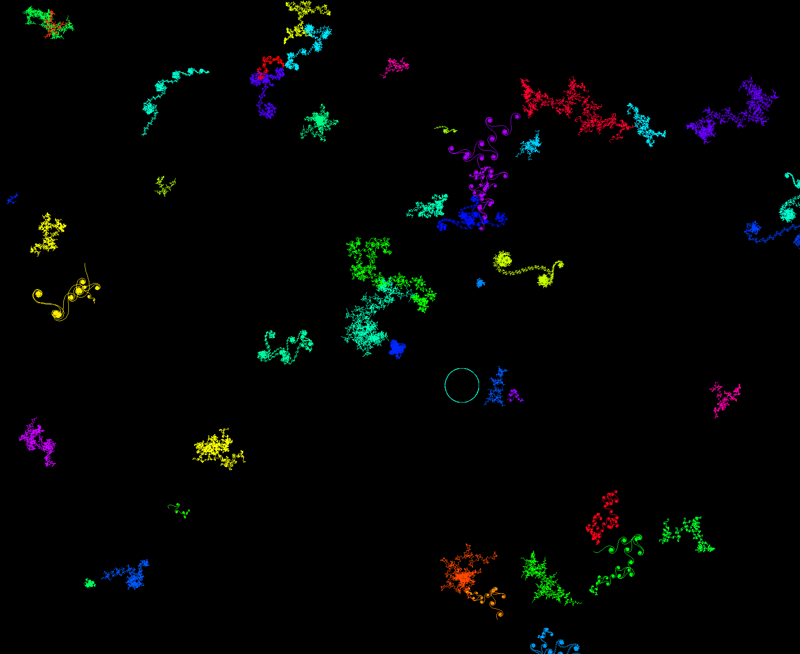
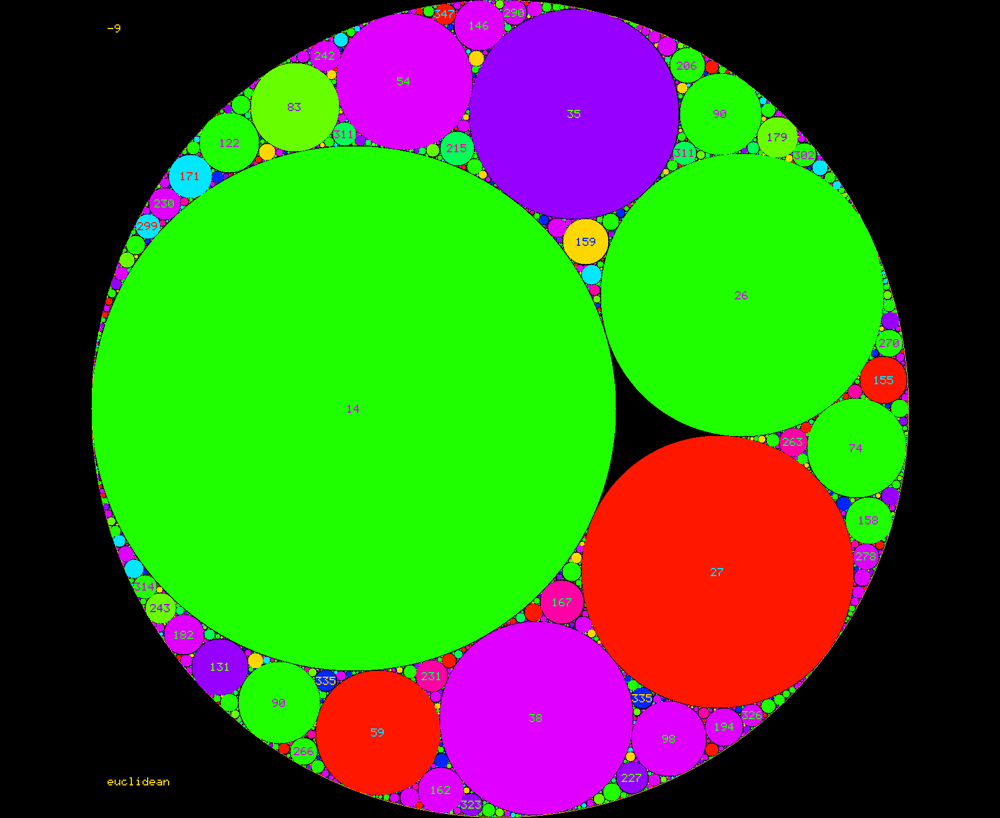
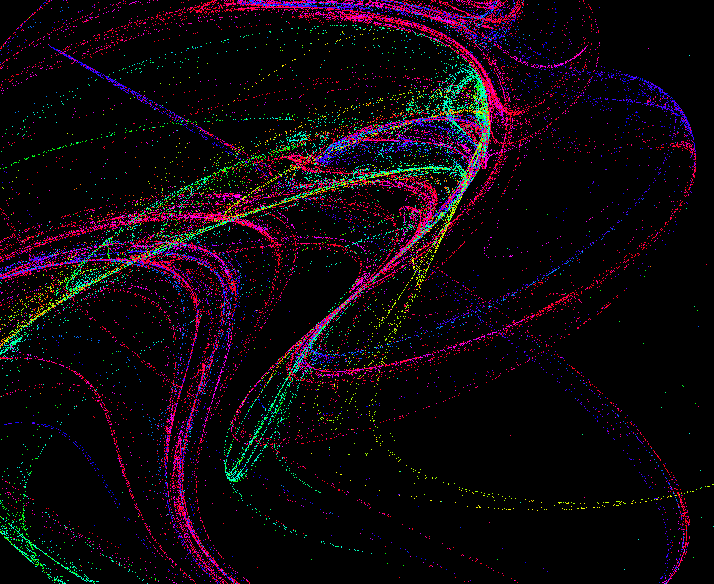
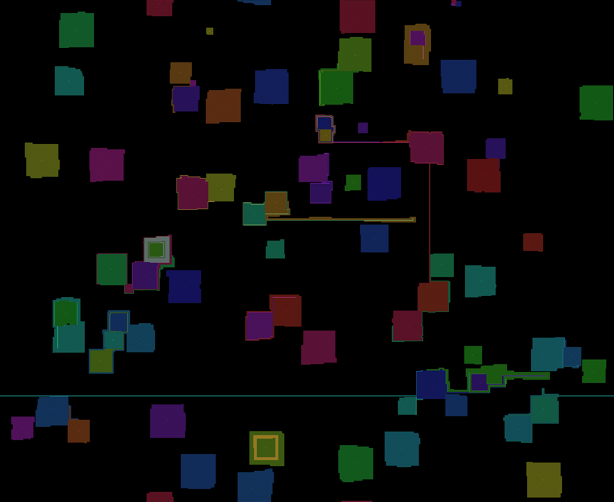
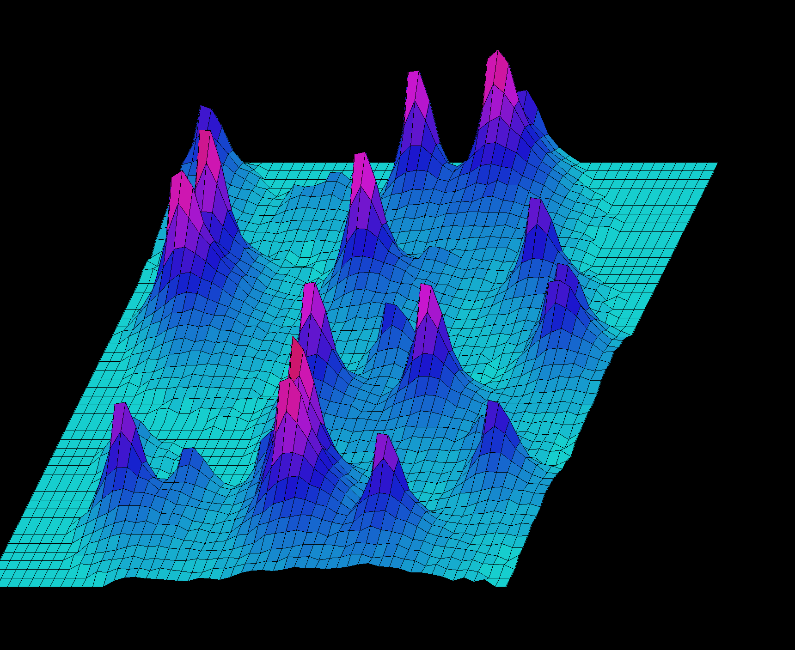
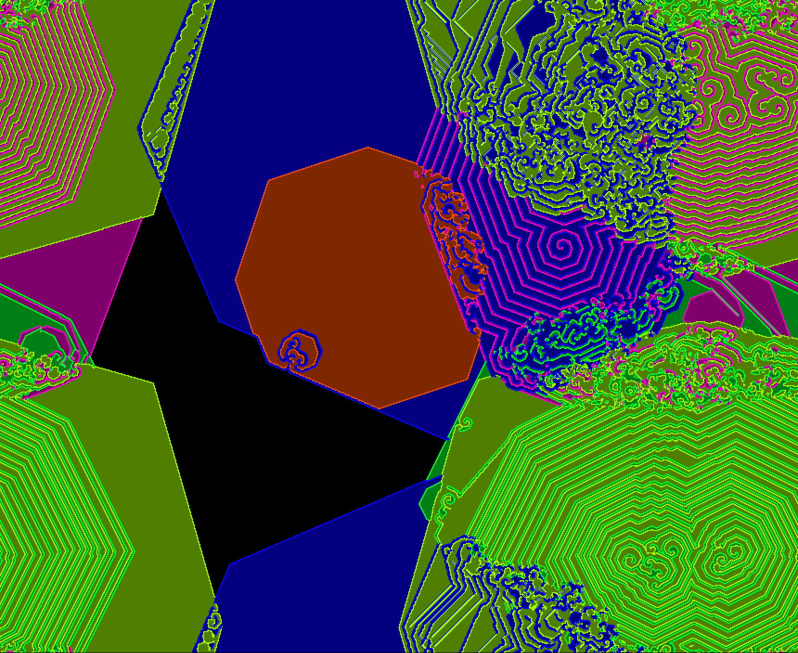
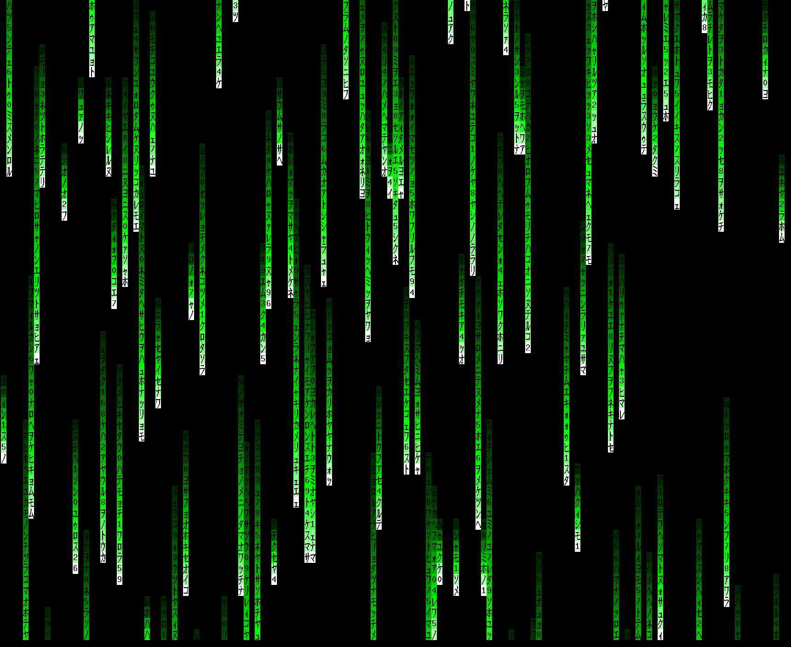
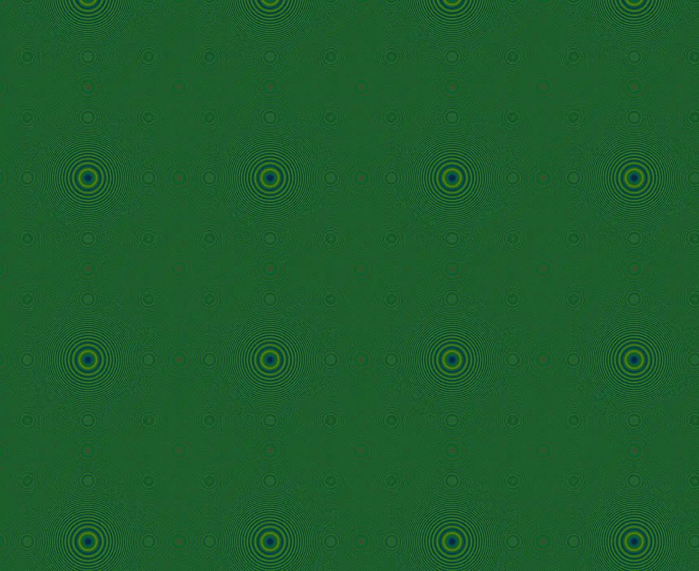

# baijia-suo
*A secure, high-performance Wayland screen locker.*

`baijia-suo` (百家锁 - "The Lock of a Hundred Families") is a screen locker for Wayland compositors supporting the `ext-session-lock-v1` protocol. It is built in Rust with a focus on security: out-of-process PAM authentication, mlocked and zeroized secret buffers, process hardening, and a fail-closed design.

> **Status:** personal open-source project, **not** independently security-audited. A screen locker is a security boundary — evaluate it against your own threat model before relying on it. See [`SECURITY.md`](.github/SECURITY.md).

| | | |
|---|---|---|
|  |  |  |
|  |  |  |
|  |  |  |
|  |  |  |

*Eleven of the 66 animated backgrounds ported from xlockmore / xscreensaver, at default settings — `coral` (with the default fade typing indicator lit), `spiral`, `vines`, `apollonian`, `mandelbrot`, `drift`, `squiral`, `mountain`, `boxfit`, `petri`, and `matrix`.*

## Features

- **Secure by Design:**
  - PAM runs in a forked child that drops privileges, so the process driving
    the lock screen never holds the authentication stack.
  - Password buffers are page-aligned, `mlock`ed, and wiped with volatile
    writes before being freed. Locking is best effort: see
    [SECURITY.md](.github/SECURITY.md) for what is and is not guaranteed.
  - Core dumps and non-root `ptrace` disabled (`PR_SET_DUMPABLE`).
  - `unsafe` is confined to seven named FFI modules; everything else,
    including all 35k lines of animation code, is `#![forbid(unsafe_code)]`.
- **Modern Wayland:**
  - Uses the `ext-session-lock-v1` protocol.
  - Once locked, no failure path unlocks: a crash, panic, signal or lost
    compositor connection ends the process without sending an unlock, and the
    session stays locked. That is a lockout, not a bypass.
  - A malformed config file never prevents locking; it falls back to a black
    screen and warns.
- **Customizable Rendering:**
  - RGBA background colors and a large set of animated backgrounds
    (xlockmore / xscreensaver ports).
  - Configurable typing indicator animations.

## Usage

Run the locker from a terminal within your Wayland session:

```sh
baijia-suo --color 1a2b3cFF --animation spiral --daemonize
```

Pass several modes to cycle through them (shuffled), with `--cycle` seconds
of airtime each; `random` (or `all`) selects every mode:

```sh
baijia-suo --animation spiral,flame,worm --cycle 45
baijia-suo --animation random --cycle 30
```

### Configuration Options

Options can be passed on the command line or set in a TOML config file,
loaded from `-C <path>` if given, else `~/.config/baijia-suo/config.toml`
(respecting `$XDG_CONFIG_HOME`), else `/etc/baijia-suo/config.toml`.
Command-line flags override file values.

```toml
color = "1a2b3c"                 # background, RRGGBB(AA)
animation = ["ripple", "flame"]  # one mode, a list to cycle, or "random"
cycle = 60                       # seconds per mode when cycling
daemonize = false

[indicator]
mode = "fade"          # fade, pin-tumbler, comet, breath, dots, scope, ripple
opacity = 1.0          # 0.0–1.0
color = "3c3c3c"       # idle/typing disk color
```

See `docs/config.example.toml` in this repository for a commented example.

For a full list of options, run `baijia-suo --help` or see the
`baijia-suo(1)` man page.

## Architecture

1. **Main Process:** Handles Wayland protocol events, connects to the compositor, renders the UI, and captures keyboard inputs. It operates unprivileged, with memory locked and core dumps / `ptrace` disabled (`PR_SET_DUMPABLE`).
2. **Authentication Child:** An isolated process that safely manages password verification via PAM. It drops any inherited elevated gid/uid before running the PAM stack, and communicates with the main process over an anonymous pipe.

## Security

See [`SECURITY.md`](.github/SECURITY.md) for the fail-closed design intent and how to
report a vulnerability privately.

## License

`baijia-suo`'s own code is MIT-licensed — see [`LICENSE`](LICENSE).

The binary also includes third-party work under its own terms, summarized in
`LICENSE` and retained in place:

- **Animation modes** (`src/animation/modes/`) are ports of xlockmore /
  xscreensaver animations; each file preserves its original author's permissive
  copyright notice.
- **Liberation Sans** (`fonts/LiberationSans-Regular.ttf`) is under the SIL Open
  Font License 1.1 — see [`fonts/LICENSE`](fonts/LICENSE).
